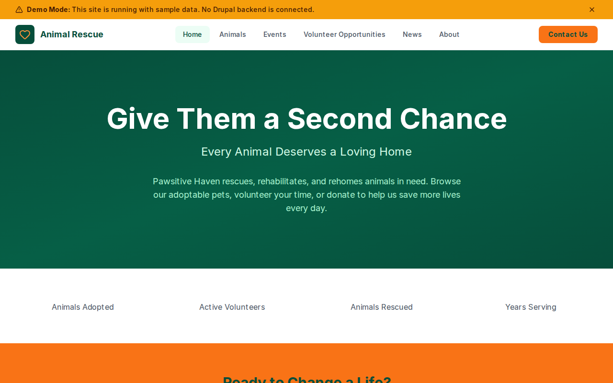

# Decoupled Animal Rescue

An animal rescue and shelter website starter template for Decoupled Drupal + Next.js. Built for animal shelters, rescue organizations, and pet adoption agencies looking to connect animals with loving homes.



## Features

- **Adoptable Animals** - Showcase dogs, cats, rabbits, and other animals with photos, breed info, age, adoption fees, and compatibility details
- **Rescue Events** - Promote adoption days, fundraisers, training workshops, and community activities with dates and registration
- **Volunteer Opportunities** - Recruit volunteers with detailed role descriptions, time commitments, and skills needed
- **News & Success Stories** - Share adoption success stories, shelter announcements, and community news
- **Modern Design** - Clean, accessible UI optimized for animal rescue content

## Quick Start

### 1. Clone the template

```bash
npx degit nextagencyio/decoupled-animal-rescue my-animal-rescue
cd my-animal-rescue
npm install
```

### 2. Run interactive setup

```bash
npm run setup
```

This interactive script will:
- Authenticate with Decoupled.io (opens browser)
- Create a new Drupal space
- Wait for provisioning (~90 seconds)
- Configure your `.env.local` file
- Import sample content

### 3. Start development

```bash
npm run dev
```

Visit [http://localhost:3000](http://localhost:3000)

---

## Manual Setup

If you prefer to run each step manually:

<details>
<summary>Click to expand manual setup steps</summary>

### Authenticate with Decoupled.io

```bash
npx decoupled-cli@latest auth login
```

### Create a Drupal space

```bash
npx decoupled-cli@latest spaces create "My Animal Rescue"
```

Note the space ID returned (e.g., `Space ID: 1234`). Wait ~90 seconds for provisioning.

### Configure environment

```bash
npx decoupled-cli@latest spaces env 1234 --write .env.local
```

### Import content

```bash
npm run setup-content
```

This imports:
- Homepage with hero section, rescue statistics, and adoption CTAs
- 5 Adoptable Animals (Bella the Golden Retriever, Shadow the Cat, Max the German Shepherd, Luna the Calico, Biscuit the Rabbit)
- 3 Events (Spring Adoption Day, Furry Friends Gala, Puppy Training Workshop)
- 3 Volunteer Opportunities (Dog Walker, Cat Socializer, Event Helper)
- 3 News Articles (Record Adoptions, New Cat Wing, Volunteer Spotlight)
- About page and Contact page

</details>

## Content Types

### Adoptable Animal
- **Species** - Taxonomy (Dog, Cat, Rabbit, Bird)
- **Breed** - Animal breed
- **Age** - Age description (e.g., "3 years", "Puppy")
- **Gender** - Male or Female
- **Adoption Fee** - Fee amount
- **Status** - Taxonomy (Available, Pending, Adopted, Foster)
- **Photo** - Animal photo
- **Good with Kids** - Boolean compatibility flag
- **Good with Other Pets** - Boolean compatibility flag

### Rescue Event
- **Event Date** - Start date and time
- **End Date** - End date and time
- **Location** - Event venue
- **Event Type** - Taxonomy (Adoption Event, Fundraiser, Community, Training)
- **Registration URL** - Link to register
- **Event Image** - Promotional image

### Volunteer Opportunity
- **Time Commitment** - Expected hours (e.g., "4 hours/week")
- **Location** - Where the volunteer works
- **Skills Needed** - Required or preferred skills
- **Image** - Role illustration

### News Article
- **Featured Image** - Article header image
- **Category** - Taxonomy (Success Stories, Announcements, Community)
- **Featured** - Boolean flag for homepage display

## Customization

### Colors & Branding
Edit `tailwind.config.js` to customize colors, fonts, and spacing.

### Content Structure
Modify `data/animal-rescue-content.json` to add or change content types and sample content.

### Components
React components are in `app/components/`. Update them to match your design needs.

## Demo Mode

Demo mode allows you to showcase the application without connecting to a Drupal backend.

### Enable Demo Mode

Set the environment variable:

```bash
NEXT_PUBLIC_DEMO_MODE=true
```

### Removing Demo Mode

To convert to a production app with real data:

1. Delete `lib/demo-mode.ts`
2. Delete `data/mock/` directory
3. Delete `app/components/DemoModeBanner.tsx`
4. Remove `DemoModeBanner` from `app/layout.tsx`
5. Remove demo mode checks from `app/api/graphql/route.ts`

## Deployment

### Vercel (Recommended)
[](https://vercel.com/new/clone?repository-url=https://github.com/nextagencyio/decoupled-animal-rescue)

Set `NEXT_PUBLIC_DEMO_MODE=true` in Vercel environment variables for a demo deployment.

### Other Platforms
Works with any Node.js hosting platform that supports Next.js.

## Documentation

- [Decoupled.io Docs](https://www.decoupled.io/docs)
- [Next.js Documentation](https://nextjs.org/docs)
- [Drupal GraphQL](https://www.decoupled.io/docs/graphql)

## License

MIT
